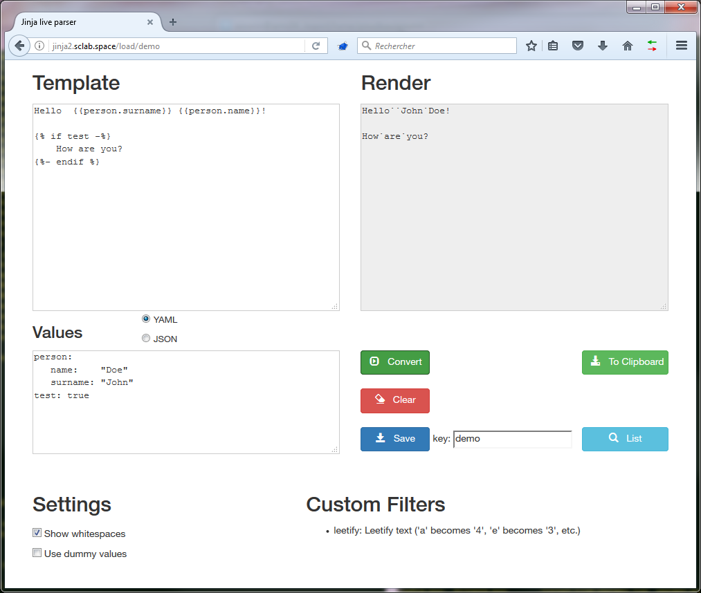
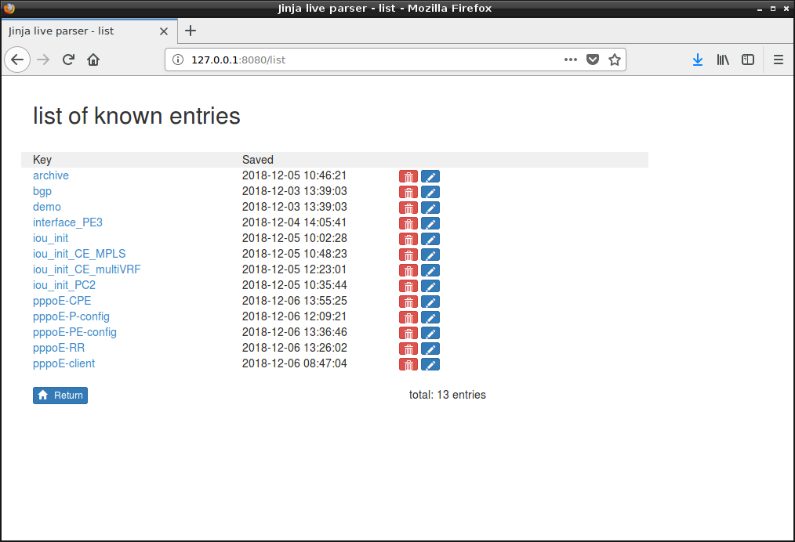

# Jinja2 live parser with database

A Jinja2 live parser based on the live parser written by Antonin Bourguignon (http://github.com:abourguignon/jinja2-live-parser) with :
- a database for saving templates and data
- a copy to clipboard button

All you need is Python and preferably [pip](https://pypi.python.org/pypi/pip). Can parse JSON and YAML inputs.

## Install

### Clone + pip + init database

    $ git clone github.com:PJO2/jinja2-live.git
    $ pip install -r requirements.txt
    $ python init_database.py
    $ python parser.py

## Usage
edit config.py, customize listen address and port
You are all set, go to `http://localhost:8080/` and have fun.  
You can add any custom filter you'd like in `filters.py`.  Just make sure the function's name starts with `filter_`.

## Preview

